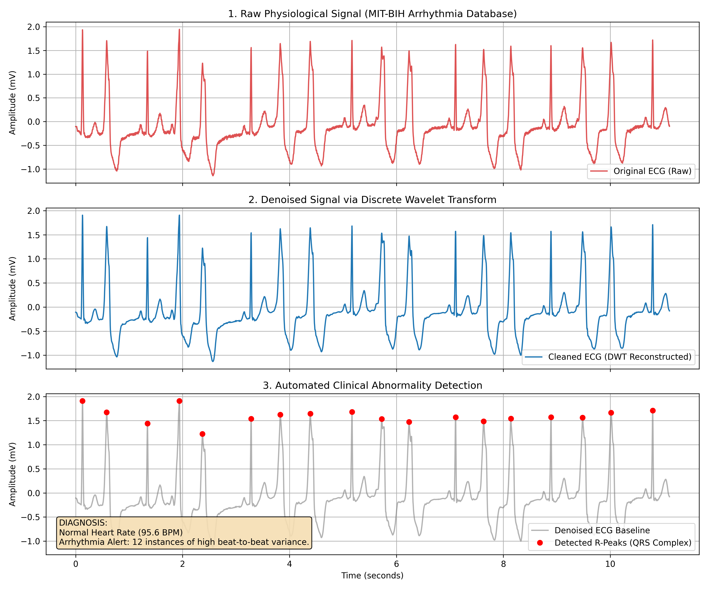

# Biomedical Signal Processing & Automated Arrhythmia Detection 🫀



## 📌 Project Overview
This project establishes an automated, end-to-end data pipeline to process, de-noise, and analyze continuous physiological time-series data. It retrieves clinical records from the **MIT-BIH Arrhythmia Database (PhysioNet)** to detect cardiac abnormalities such as Arrhythmias, Tachycardia, and Bradycardia.

This repository demonstrates the direct translation of advanced frequency sub-band manipulation techniques—originally researched and developed during the author's Master's thesis for 2D image steganography—into 1D clinical applications to mathematically isolate biological singularities and detect anomalies.

## 🧮 Mathematical Approach: Why Discrete Wavelet Transforms (DWT)?
Physiological signals like Electrocardiograms (ECGs) are heavily prone to high-frequency interference, including muscle noise, baseline wander, and sensor artifacts. Instead of relying on traditional bandpass filtering, this pipeline utilizes a **Discrete Wavelet Transform (DWT)**. 

Daubechies 4 (`db4`) is implemented as the mother wavelet because its mathematical shape is morphologically similar to the QRS complex of a human heartbeat. By decomposing the signal, applying universal soft thresholding (VisuShrink) to the high-frequency detail coefficients, and reconstructing the signal via Inverse DWT, the pipeline mathematically strips out noise without dulling the sharp biological peaks necessary for clinical diagnosis.

## 🩺 Feature Extraction & Diagnostics
As a signal processing to clinical diagnostic application, the pipeline actively maps the patient's **QRS complex**. 
* **Biological Mapping:** By using dynamic statistical thresholds, the algorithm ignores minor biological waves (like P-waves and T-waves) to strictly map the R-peaks.
* **Heart Rate Variability (HRV):** It continuously calculates the **R-R intervals** (the time distance between consecutive heartbeats).
* **Diagnostic Engine:** Evaluates the HRV against standard biostatistical bounds to generate real-time automated reporting. For example, if consecutive beats vary in length by more than 120 milliseconds, the engine triggers an Arrhythmia Alert.

### Automated Clinical Report
*Based on the analysis of MIT-BIH Record 208, the pipeline automatically generates the following diagnostic text in the terminal:*

```text
==================================================
🩺 AUTOMATED CLINICAL REPORT
==================================================
Total Heartbeats Detected: 18
Average Heart Rate:        95.6 BPM
-> Normal Heart Rate (95.6 BPM)
-> Arrhythmia Alert: 12 instances of high beat-to-beat variance.
==================================================
